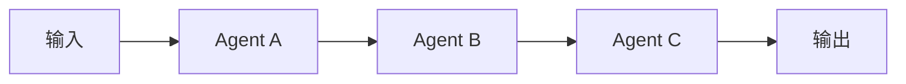
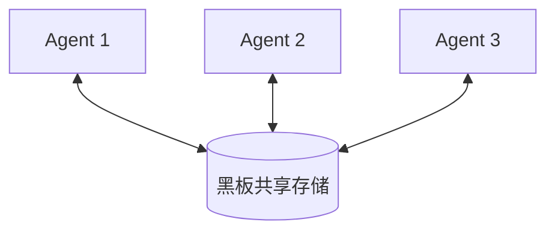
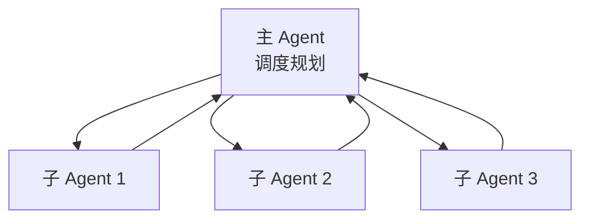
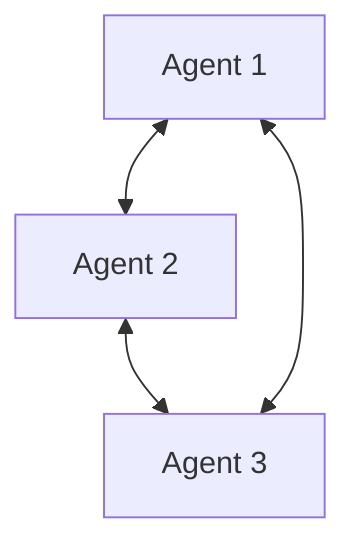
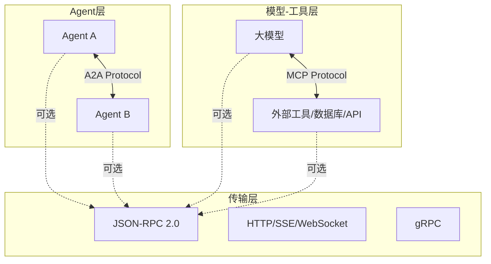
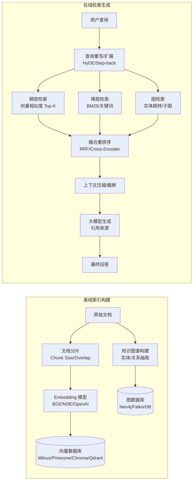
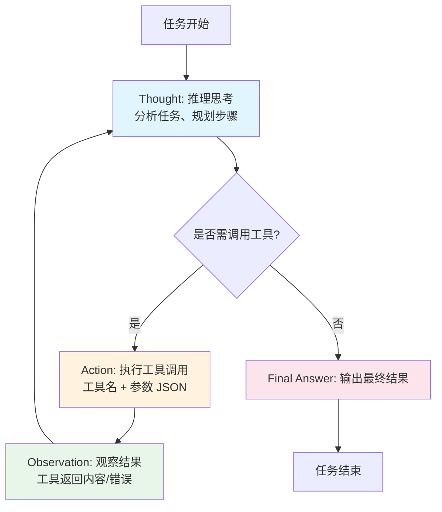

# AI 发展史 & 核心知识体系（Mermaid版）
> 适用：AI Agent / LLM 工程学习笔记
> **学习路径**：历史与流派 → **大模型 (LLM) 核心** → **AI Agent 核心** → **开发实战与工程化**

## 目录

### 第一部分：历史与流派（建立全景认知）
1. AI 发展阶段时序图（含 AI 寒冬与关键节点）
2. 符号主义 vs 连接主义对比

### 第二部分：大模型 (LLM) 核心知识（地基）
3. **什么是大模型 (LLM)？** —— 定义、特征、为何有效、主流模型谱系
4. **Transformer 核心架构** —— Encoder/Decoder、关键组件演进
5. **大模型训练范式演进** —— 预训练 → SFT → RLHF/DPO → 推理模型
6. **Scaling Laws 与能力涌现** —— 理论支撑与规模效应
7. 关键架构演进：从感知机到 Transformer 再到 MoE/SSM

### 第三部分：AI Agent 核心知识（重点）
8. **什么是 AI Agent？** —— 定义、核心能力、与 LLM 区别、三代演进
9. **AI Agent 最小核心架构** —— 规划、工具、记忆、反思闭环
10. 多 Agent 协作架构（4 种模式 Mermaid）
11. A2A / MCP / JSON-RPC 通信协议层

### 第四部分：开发实战与工程化（落地）
12. Agent 开发框架选型（LangGraph/LlamaIndex/AutoGen等）
13. RAG 检索增强生成架构（知识注入工程）
14. ReAct 执行循环与变体（推理-行动范式）
15. Token 计费与成本控制策略
16. 评测体系与对齐安全
17. 训练/推理基础设施要点（vLLM/量化/部署/监控）

## 1. AI 发展阶段时序图

### 1.1 AI 整体技术演进：四阶段速览表（总览）
| 阶段 | 核心范式 | 典型技术 | 关键特征 |
|------|----------|----------|----------|
| **1950s-80s** | **符号主义** | 专家系统、规则引擎、逻辑编程（大量 if-else） | 知识显式、可解释、规则爆炸、无感知 |
| **1990s-2010s** | **传统机器学习** | SVM、随机森林、Adaboost、人工特征工程 (SIFT/HOG) | 浅层模型、需特征工程、结构化数据强 |
| **2012-2017** | **深度学习** | CNN/RNN/LSTM、自动特征提取、AlexNet/ResNet | 端到端、感知突破、需大量标注数据 |
| **2017-至今** | **Transformer + 大模型** | BERT/GPT、Scaling Laws、多模态、推理模型 (o1/o3) | 预训练+微调、涌现能力、少样本泛化、Agent 化 |

### 1.2 AI 整体技术演进时间线（详细节点）
timeline
    title AI发展时间线（含关键节点与寒冬期）
    1943 : McCulloch-Pitts 神经元模型，神经网络雏形
    1950 : 图灵测试提出，AI 学科正式诞生
    1956 : 达特茅斯会议，"人工智能" 术语确立
    1957 : Rosenblatt 感知机，首个可学习神经网络
    1969 : Minsky《Perceptrons》证明单层感知机局限 → **第一次 AI 寒冬**
    1970s ~ 80s : 专家系统爆发（MYCIN、DENDRAL） → 符号主义巅峰
    1986 : 反向传播算法普及（Rumelhart等），多层感知机复兴
    1987 : 专用硬件市场崩溃、专家系统维护成本高 → **第二次 AI 寒冬**
    1990 ~ 2012 : 传统机器学习黄金期<br/>SVM、随机森林、Adaboost、人工特征工程（SIFT/HOG/LBP）
    1997 : IBM深蓝击败卡斯帕夫，象棋AI里程碑
    2006 : Hinton深度置信网络（DBN），无监督预训练突破 → 深度学习复苏
    2012 : AlexNet 夺得 ImageNet 冠军，CNN 统治视觉，**深度学习时代正式开启**
    2014 : GAN 生成对抗网络；Seq2Seq + Attention 机制
    2015 : ResNet 残差网络，解决深层网络退化
    2017 : Transformer 论文《Attention Is All You Need》发布
    2018 : BERT（Encoder-only，双向预训练）；GPT-1（Decoder-only，生成式预训练）
    2019 : GPT-2（15亿参数，零样本泛化）；XLNet、RoBERTa、T5
    2020 : GPT-3（1750亿参数），In-context Learning / Prompt 范式确立；Scaling Laws 论文
    2021 : CLIP 多模态对比学习；Codex 代码生成
    2022 : ChatGPT (GPT-3.5 + RLHF) 发布，对话式大模型引爆应用层
    2023 : GPT-4 多模态；LLaMA 开源生态爆发；Agent 概念普及
    2024 : o1/o3 推理模型（长思维链、测试时计算扩展）；MoE 稀疏架构主流化
    2025 ~ : Agentic AI、世界模型、具身智能、A2A/MCP 标准化、LLMOps 成熟

### 1.2 Agent 发展史（独立演进线）
> **Agent ≠ 模型**。Agent 强调：自主感知 → 规划 → 行动 → 环境反馈 → 闭环。

timeline
    title Agent 三代演进
    1990s ~ 2010s : **第 1 代：符号式 Agent**<br/>手工规则 / 状态机 / 行为树 / 专家系统包装<br/>典型：游戏 NPC、RPA、早期智能客服<br/>特点：完全可控、可解释，但脆弱、规则爆炸、零泛化
    2013 ~ 2020 : **第 2 代：学习式 Agent (RL / 模仿学习)**<br/>策略网络 + 价值网络，海量交互训练固化策略<br/>典型：AlphaGo、DQN、OpenAI Five、机器人控制<br/>特点：能处理复杂感知决策，但训练极贵、泛化差、部署难
    2022 ~ 至今 : **第 3 代：LLM-based Agent (现代 Agent)**<br/>**大模型做规划器** + Tool Use + Memory + ReAct + 多 Agent 协作<br/>典型：AutoGPT、ChatGPT Plugins、LangGraph、OpenCode、Devin<br/>特点：**涌现式规划、零样本泛化、自然语言调用工具、开发成本骤降**

### 1.3 三代 Agent 核心对比
| 维度 | 第 1 代：符号式 | 第 2 代：RL/模仿学习 | **第 3 代：LLM Agent (现在)** |
|------|-----------------|----------------------|------------------------------|
| **规划来源** | 硬编码规则/状态机 | 训练固化策略网络 | **推理时涌现 (CoT/ReAct/ToT)** |
| **工具使用** | 预定义 API 硬编码 | 需训练适配每个工具 | **自然语言动态调用、函数发现** |
| **知识来源** | 人工注入规则库 | 环境交互学习 (经验回放) | **参数化知识 + RAG + 上下文** |
| **泛化能力** | 零泛化 (分布外即失效) | 弱泛化 (需微调/再训练) | **强零样本/少样本泛化** |
| **开发成本** | 极高 (规则爆炸、维护地狱) | 极高 (算力/数据/调参) | **相对低 (Prompt/少量微调)** |
| **可解释性** | 高 (规则透明) | 低 (黑盒策略) | 中 (思维链可观测、但内部黑盒) |
| **典型场景** | 确定性流程、合规强领域 | 固定环境高频决策 (游戏/机器人) | **开放域、长任务、需推理规划** |

> **核心质变**：第 3 代把「规划」从 **「训练时固化」** 变成了 **「推理时涌现」**，这是 LLM Agent 相对前两代的根本突破。


## 2. 符号主义 vs 连接主义

### 2.1 定义速览
| 流派 | 别名 | 一句话定义 | 核心隐喻 |
|------|------|------------|----------|
| **符号主义** | Symbolism / GOFAI (Good Old-Fashioned AI) | **智能 = 符号操作 + 逻辑推理** | 大脑像**数字计算机**，运算符号 |
| **连接主义** | Connectionism / 深度学习 / 神经网络派 | **智能 = 大规模神经网络 + 统计拟合** | 大脑像**神经网络**，连接权重存储知识 |

> **历史地位**：两大流派贯穿 AI 史。
> - **1950s-80s**：符号主义统治（专家系统巅峰）
> - **1986-2010s**：连接主义复苏（BP算法→深度学习）
> - **2017-至今**：Transformer 统一范式，**神经符号融合**成主流落地模式

### 2.2 核心对比
| 类别 | 符号主义 (Symbolism / GOFAI) | 连接主义 (Connectionism / 深度学习) |
|------|------------------------------|-------------------------------------|
| **核心思想** | 智能 = 符号操作 + 逻辑推理 | 智能 = 大规模神经网络 + 统计拟合 |
| **知识表示** | 显式：符号、规则、逻辑公式、本体 | 隐式：分布在网络权重/激活值中 |
| **推理方式** | 演绎/归纳/溯因，确定性规则链 | 近似计算，概率分布采样 |
| **学习方式** | 人工编码知识库、专家规则 | 海量数据 + 反向传播自动学习特征 |
| **典型代表** | 专家系统、知识图谱、Prolog、CyC、规则引擎 | CNN、RNN、Transformer、GPT、BERT |
| **优点** | 可解释、可控、少样本泛化强、逻辑严密 | 感知强、端到端免特征工程、泛化强、抗噪声 |
| **缺点** | 知识获取瓶颈、规则爆炸、维护贵、弱感知 | 黑盒、需海量数据算力、幻觉、推理弱、不可控 |

### 为什么现在主流是「神经符号融合」？
单纯任一流派都有天花板，**现代 Agent/大模型落地多采用混合架构**：

| 场景 | 连接主义（大模型）负责 | 符号主义（工具/引擎）负责 |
|------|------------------------|---------------------------|
| **代码生成** | 理解意图、生成草稿 | 语法检查、类型推导、单元测试、执行验证 |
| **数学推理** | 直觉式步骤规划 | 符号计算器、定理证明器、Python 沙箱 |
| **知识问答** | 语义理解、查询改写 | 知识图谱精准检索、SQL 执行、约束求解 |
| **规划决策** | 任务拆解、策略生成 | PDDL 规划器、约束满足求解器、流程引擎 |
| **结构化抽取** | 语义理解、实体识别 | Schema 约束、类型校验、一致性检查 |

> **核心范式**：**大模型做「理解、生成、规划、直觉」；符号系统做「精确、验证、执行、逻辑」**。
> 
> 这也是现代 Agent 架构中「规划器+工具模块」分离的理论根基：规划器用连接主义，工具调用落地符号主义。

---

# 第二部分：大模型 (LLM) 核心知识（地基）

## 3. 什么是大模型 (LLM)？

### 3.1 定义
**大语言模型 (Large Language Model, LLM)**：基于 Transformer 架构、在**万亿级文本语料**上通过**自监督预训练**（Next Token Prediction）获得的、具有**涌现能力**的参数化知识模型。

#### 3.1.1 简单理解：它是个「极其复杂的下一个字预测器」

1. LLM 是带参数 \(\theta\) 的函数 \(f_\theta\)，输入是**变长 Token 序列**，输入长度受上下文窗口限制（4k~2M+）
2. 前向推理输出不是直接文字，而是 **Logits（未归一化分数），经过 softmax 得到词表上的概率分布**
3. **自回归生成**：把采样出来的 token 追加到上下文，作为新输入，循环预测下一个 token，直到终止符。
4. 一句话总结的通俗比喻：**下一个 token 预测器**，是行业最通用的入门解释。

核心概念注释（必懂）
- Logits（原始分值）：模型最后一层直接输出的一组实数，可正可负、没有范围限制、总和不为1，不是概率，仅代表模型对每个候选Token的原始偏好分数。
- Softmax（归一化函数）：对Logits做数学变换，将所有分值压缩到 0~1 区间，且所有Token分值总和为1，转化为标准概率分布，让结果可对比、可采样。
- 采样机制
  - 贪心采样：每次直接选概率最高的Token，输出稳定、死板，容易重复、僵硬；
  - Top-K/Top-P采样：从高概率候选Token中随机抽样，引入随机性，日常对话、写作、创作全部用这种，输出更自然、多样。
- 自回归生成：LLM没有“一次性写完回答”的能力，只能逐Token预测、逐Token拼接，循环往复直到生成结束符，是所有生成式大模型的核心逻辑。


**一句话总结**：
> **LLM = 超大参数函数 $f_\theta$，读一段文本 → 输出原始Logits分值 → 经Softmax转为Token概率分布 → 逐词采样、循环拼接，最终生成完整文本，实现写作、编码、对话、推理等能力。**

底层目标是预测下一个 token；输出原始结果是 logits，softmax 得到概率；生成是循环自回归，**不一定每次都选概率最高的词**。


| 关键点 | 通俗解释 |
|--------|----------|
| **参数量「大」** | 函数里的「旋钮」有几亿到几万亿个（人脑神经元 ~860 亿） |
| **预训练** | 读遍互联网，调好旋钮，学会「语言规律+世界知识+推理模式」 |
| **上下文学习** | 不用改旋钮，只要在输入里给几个例子，它就能「现学现用」 |
| **涌现能力** | 旋钮多到一定程度，突然会做以前不会的事（推理、写代码、少样本泛化） |

#### 3.1.2 核心维度表
| 维度 | 说明 |
|------|------|
| **架构基础** | Transformer Decoder-only (GPT/LLaMA) 或 Encoder-Decoder (T5) |
| **参数量级** | 通常 > 1B，主流 7B~1T+（MoE 稀疏激活可达万亿总参数） |
| **训练数据** | CommonCrawl、代码库、书籍、论文、多语言文本，经清洗去重 |
| **核心任务** | 预训练：Next Token Prediction → 捕捉语言结构、世界知识、推理模式 |
| **关键特征** | **In-context Learning**（上下文学习）、**少样本泛化**、**指令跟随**、**思维链推理** |
| **输入/输出** | 输入：Token IDs (变长，上下文窗口 4k~2M+) → 输出：Logits/概率分布 → 采样得 Token |

Encoder-only 一般用于理解类任务，不是生成式 LLM

#### 3.1.3 模型规模怎么分？（常说的「7B/72B」是什么意思）
> **「100亿级大模型」= 参数量约 100 亿（10B）**，指神经网络里的「权重/旋钮」数量。

| 级别 | 参数量 | 典型代表 | 部署门槛 | 能力/场景 |
|------|--------|----------|----------|----------|
| **小模型** | < 1B | Phi-3-mini (3.8B), Gemma-2B | 手机/边缘设备 (2-4GB) | 简单分类、摘要、指令跟随弱 |
| **中模型** | **7B ~ 14B** | **LLaMA-3-8B, Qwen2.5-7B/14B, Mistral-7B** | **消费级 GPU (24GB/48GB)** | **主流甜点：推理/编码/中文强，可微调** |
| **大模型** | **70B ~ 100B** | **LLaMA-3-70B, Qwen2.5-72B, DeepSeek-V2-Lite** | 多卡/服务器 (A100×4~8) | 接近 GPT-3.5，复杂推理、Agent可用 |
| **超大模型** | 100B+ 稠密 / 万亿 MoE | GPT-4, Claude 3.5, DeepSeek-V3 (MoE 671B) | 专用集群 | 旗舰能力，多模态、强推理、工具熟练 |

**体积参考（FP16 半精度）**：7B ≈ 14 GB、14B ≈ 28 GB、72B ≈ 144 GB  
**量化后（INT4）**：理论体积除以 4 → 7B ≈ 4 GB；72B INT4 权重本身约 36GB，**单 24G 显卡无法完整载入权重，需要内存卸载，推理速度会明显下降；24G 卡适合稳定跑 7B/14B INT4**

> **选型经验**：个人学习 → 7B/14B (INT4 单卡)；企业微调 → 14B/32B (双/四卡)；生产级 Agent → 72B+ (多卡集群或 API)

### 3.1.4 参数量 = 架构定死，训练只改数值

| 概念 | 说明 |
|------|------|
| **参数量（数量）** | 由架构超参数（层数、隐藏维度、词表大小）决定，**初始化即固定**，训练全程不变 |
| **参数值（权重/数值）** | 初始化为随机数，**训练中不断被优化器更新**（梯度下降/AdamW），推理时冻结 |
| **形象比喻** | 架构 = 房子户型（几室几厅固定）；参数值 = 家具摆放位置（装修时移动，住人时固定） |

> **推论**：同一架构（如 LLaMA-3-8B），不管训练多少数据、多少步、用什么优化器，**最终模型文件大小完全一样**（同精度下），只有里面的数字不同。

**架构超参数 → 参数量映射（以 LLaMA 为例）：**
| 超参数 | 典型值 | 主要影响 |
|--------|--------|----------|
| `n_layers` (层数) | 32 | 深度，线性增参 |
| `d_model` (隐藏维度) | 4096 | 宽度，**平方级增参**（Attention 4×d², FFN ~8×d²） |
| `vocab_size` (词表) | 128k | Embedding + Output Head |
| `d_ff` (FFN 隐藏层) | 11008 | FFN 参数量主导 |

### 3.2 为什么有效？（三大支柱）
1. **Scaling Laws**：在数据质量、数量充足的前提下，参数 N、数据 D、算力 C 按幂律扩展 → Loss 持续下降、模型能力逐步涌现；若数据不足，单纯堆叠参数无法提升模型效果
2. **Transformer 并行化**：Self-Attention 打破 RNN 串行瓶颈，支持海量 Token 并行训练，适配万亿级语料训练场景。
3. **预训练+微调范式**：大规模无监督预训练学习通用语言表示与世界知识，少量有监督微调即可快速适配各类下游任务。

### 3.3 主流模型谱系（2024-2025）
| 系列 | 代表模型 | 架构 | 特点 | 适用场景 |
|------|----------|------|------|----------|
| **GPT** | GPT-4o, GPT-4o-mini, o1, o3 | Decoder-only | 闭源、多模态、推理强 | 通用旗舰、复杂推理 |
| **Claude** | 3.5 Sonnet, 3.5 Haiku, Opus | Decoder-only | 编码强、长上下文、安全对齐好 | 代码生成、长文档 |
| **LLaMA** | LLaMA-3.1 (8B/70B/405B) | Decoder-only, GQA, RoPE | 开源权重、社区生态最强 | 自托管、微调基座 |
| **Qwen** | Qwen2.5 (0.5B~72B), QwQ | Decoder-only, 多语言强 | 阿里开源、中文最强、工具调用好 | 中文场景、Agent基座 |
| **DeepSeek** | DeepSeek-V3 (MoE), DeepSeek-R1 | MoE + MLA, 推理模型 | 极低成本、开源推理模型 | 高性价比部署、数学推理 |
| **MoE 系列** | Mixtral 8x7B/8x22B, Nemotron | 稀疏 MoE | 激活参数少、推理快 | 大模型低成本服务 |

> **选型原则**：闭源 API（快速上线、旗舰能力） vs 开源自托管（数据隐私、成本控制、定制微调）

## 4. Transformer 核心架构（LLM 的地基）

> 详细结构见 **第 10 节**，此处仅列核心要点：
>
> | 组件 | 早期 | 现代主流 (LLaMA3, Qwen2, DeepSeek) | 作用 |
> |------|------|-----------------------------------|------|
> | 位置编码 | 绝对正弦/可学习 | **RoPE** (旋转位置编码，外推性好) | 注入位置信息 |
> | 归一化 | Post-LN | **Pre-RMSNorm** (更稳定，无均值计算) | 训练稳定性 |
> | 激活函数 | ReLU/GeLU | **SwiGLU** (门控线性单元) | 表达能力 |
> | 注意力 | 标准 MHA | **GQA/MQA** (分组/多查询注意力) | 推理加速 |
> | 并行策略 | 张量并行 | **SP + TP + PP + EP** | 大规模训练 |
>
> - **Decoder-only (GPT/LLaMA)**：因果掩码 Self-Attention + KV Cache → 自回归生成
> - **Encoder-only (BERT)**：双向全注意力 → 理解类任务
> - **Encoder-Decoder (T5)**：条件生成 → 翻译/摘要

## 5. 大模型训练范式演进：预训练 → SFT → RLHF/DPO → 推理模型
| 时期 | 代表架构 | 核心创新 | 适用场景 |
|------|----------|----------|----------|
| 1957 | 感知机 | 单层线性分类 | 线性可分问题 |
| 1986 | MLP + BP | 多层非线性、反向传播 | 通用函数拟合 |
| 1998 | LeNet-5 | CNN（卷积+池化），平移不变性 | 图像分类 |
| 2012 | AlexNet | ReLU、Dropout、GPU训练、数据增强 | 大规模视觉 |
| 2014 | VGG/GoogLeNet | 深层堆叠、Inception模块 | 更深网络 |
| 2015 | ResNet | 残差连接，解决梯度消失 | 超深网络(100+) |
| 2017 | Transformer | Self-Attention，并行化，长程依赖 | NLP/多模态基座 |
| 2018 | BERT | Encoder-only，MLM+NSP，双向编码 | NLU任务(分类/QA) |
| 2018 | GPT-1 | Decoder-only，单向自回归，生成式预训练 | 文本生成 |
| 2020 | GPT-3 | 1750亿参数，In-context Learning，少样本 | 通用大模型范式 |
| 2022 | Chinchilla Scaling Laws | 最优数据/参数比 ~20:1 | 训练资源分配指导 |
| 2022~ | MoE (Mixtral, DeepSeekMoE) | 稀疏激活，专家并行，推理加速 | 超大模型低成本部署 |
| 2024 | Mamba/SSM | 线性注意力，O(N) 推理，状态空间模型 | 超长上下文 |
| 2024 | o1/o3 | 测试时计算扩展，长CoT，强化学习训练推理 | 复杂数理推理 |

> **架构演进主线**：感知机 → 多层网络 → CNN(视觉) → RNN/LSTM(序列) → Transformer(统一) → MoE/SSM(效率) → 推理模型(能力)

## 4. 大模型训练范式演进
```
阶段1：预训练
├─ 目标：学习世界知识、语言结构、推理基础
├─ 数据：万亿级互联网语料（CommonCrawl、代码、书籍、论文）
├─ 目标函数：Next Token Prediction (自回归) / MLM (BERT类)
└─ 产出：Base Model（基座模型，只有续写能力，无指令跟随）

阶段2：SFT (Supervised Fine-Tuning)
├─ 目标：获得指令跟随、对话格式、特定任务能力
├─ 数据：高质量指令数据（ShareGPT、UltraChat、人工标注）
├─ 方法：全参数微调 / LoRA / QLoRA
└─ 产出：Instruct Model（可对话、可执行指令）

阶段3：对齐
├─ RLHF (PPO)：
│  ├─ 奖励模型 RM：人类偏好标注 → 训练 RM 打分
│  └─ PPO 优化：策略模型对齐 RM 偏好
├─ DPO (Direct Preference Optimization)：
│  └─ 无需 RM，直接用偏好对数据优化，更稳定、少超参
├─ RLAIF / Constitutional AI：AI 反馈替代人类标注
└─ 产出：Aligned Model（安全、有用、诚实）

阶段4：推理增强
├─ CoT 训练：在 SFT/RL 阶段引入思维链数据
├─ Process Reward Model (PRM)：逐步监督而非仅结果监督
├─ 测试时计算扩展：生成多条推理路径、自我验证、Best-of-N
└─ 产出：Reasoning Model (o1, o3, DeepSeek-R1, QwQ)
```

## 5. Scaling Laws 与模型能力涌现
**Kaplan Scaling Laws (2020)**：
- Loss ∝ N^(-α) · D^(-β) · C^(-γ)
- 模型大小 N、数据量 D、计算量 C 三者幂律关系
- **最优分配**：固定算力下，N 与 D 应同比例增长

**Chinchilla Scaling Laws (2022, DeepMind)**：
- 修正 Kaplan：数据比参数更重要
- **最优数据/参数比 ≈ 20:1**（即 1B 参数需 20B tokens）
- GPT-3 (175B, 300B tokens) **显著欠训练**；LLaMA-1/2/3 按 Chinchilla 训练

**能力涌现**：
- 任务性能随规模平缓增长，突破临界点后**陡然跃升**
- 典型涌现能力：上下文学习、思维链推理、多步推理、代码生成、指令跟随
- **临界点参考**：~100B 参数、~1T tokens、~10^24 FLOPs

## 6. 关键架构演进：从感知机到 Transformer 再到 MoE/SSM

> 补充视角：Transformer 之前的演进脉络
| 时期 | 代表架构 | 核心创新 | 适用场景 |
|------|----------|----------|----------|
| 1957 | 感知机 | 单层线性分类 | 线性可分问题 |
| 1986 | MLP + BP | 多层非线性、反向传播 | 通用函数拟合 |
| 1998 | LeNet-5 | CNN（卷积+池化），平移不变性 | 图像分类 |
| 2012 | AlexNet | ReLU、Dropout、GPU训练、数据增强 | 大规模视觉 |
| 2014 | VGG/GoogLeNet | 深层堆叠、Inception模块 | 更深网络 |
| 2015 | ResNet | 残差连接，解决梯度消失 | 超深网络(100+) |
| 2017 | Transformer | Self-Attention，并行化，长程依赖 | NLP/多模态基座 |
| 2018 | BERT | Encoder-only，MLM+NSP，双向编码 | NLU任务(分类/QA) |
| 2018 | GPT-1 | Decoder-only，单向自回归，生成式预训练 | 文本生成 |
| 2020 | GPT-3 | 1750亿参数，In-context Learning，少样本 | 通用大模型范式 |
| 2022 | Chinchilla Scaling Laws | 最优数据/参数比 ~20:1 | 训练资源分配指导 |
| 2022~ | MoE (Mixtral, DeepSeekMoE) | 稀疏激活，专家并行，推理加速 | 超大模型低成本部署 |
| 2024 | Mamba/SSM | 线性注意力，O(N) 推理，状态空间模型 | 超长上下文 |
| 2024 | o1/o3 | 测试时计算扩展，长CoT，强化学习训练推理 | 复杂数理推理 |

> **架构演进主线**：感知机 → 多层网络 → CNN(视觉) → RNN/LSTM(序列) → Transformer(统一) → MoE/SSM(效率) → 推理模型(能力)

---

# 第三部分：AI Agent 核心知识（重点）

## 7. 什么是 AI Agent？

### 7.1 定义
**AI Agent（智能体）**：具备**自主性**、**目标导向**、**环境交互**能力的 AI 系统。能感知环境、规划决策、调用工具执行动作、从反馈中学习、形成闭环。

| 核心要素 | 说明 |
|----------|------|
| **感知** | 多模态输入（文本/图像/音频/结构化数据） |
| **规划** | 任务分解、策略生成、多步推理 |
| **行动** | 工具调用、API 请求、代码执行、浏览器操作 |
| **记忆** | 短期上下文 + 长期持久化（向量/图谱/KV） |
| **反思** | 结果校验、错误诊断、策略修正、经验积累 |
| **目标** | 显式指令或隐式偏好驱动 |

### 7.2 LLM vs Agent：本质区别
| 维度 | **LLM (大模型)** | **AI Agent** |
|------|------------------|--------------|
| **本质** | 静态函数：Input → Output | 动态系统：循环执行直到目标达成 |
| **能力** | 单轮生成、知识问答、文本续写 | 多步规划、工具使用、状态维护、长任务 |
| **记忆** | 仅上下文窗口 | 分层记忆体系（短期/长期/工作记忆） |
| **工具** | 无原生工具调用（需 Function Calling） | 原生工具生态、动态发现、组合执行 |
| **自主性** | 被动响应 | 主动规划、可中断、可人工介入 |
| **典型用法** | `completion(prompt)` | `agent.run(task)` → 循环执行 |

> **核心结论**：**LLM 是 Agent 的「大脑」，Agent 是 LLM 的「手脚+神经系统」**。单纯调用 LLM API ≠ Agent。

### 7.3 Agent 三代演进史
| 代数 | 时期 | 核心范式 | 规划来源 | 典型代表 | 局限 |
|------|------|----------|----------|----------|------|
| **第 1 代：符号式** | 1990s-2010s | 规则/状态机/行为树 | 硬编码 | 游戏 NPC、RPA、专家系统 | 脆弱、零泛化、维护地狱 |
| **第 2 代：学习式** | 2013-2020 | RL/模仿学习 | 训练固化策略网络 | AlphaGo、DQN、OpenAI Five | 训练极贵、泛化差、环境强绑定 |
| **第 3 代：LLM-based** | 2022-至今 | **LLM 做规划器** + Tool + Memory | **推理时涌现** | AutoGPT、LangGraph、Devin、OpenCode | 幻觉、成本、可靠性待提升 |

> **质变**：第 3 代把「规划」从 **「训练时固化」** 变成 **「推理时涌现」**，零样本泛化、自然语言调用工具、开发成本骤降。

## 8. AI Agent 最小核心架构
flowchart TD
    User[用户任务] --> Planner[规划器 Planning<br/>CoT / ReAct / Tree-of-Thought]
    Planner -->|无需工具| LLM[大模型直接推理] --> Answer[输出答案]
    Planner -->|需工具| Tool[工具模块<br/>Search / DB / API / Code / Browser]
    Tool --> Obs[Observation 观察结果]
    Obs --> Planner
    
    Memory[(记忆模块<br/>短期对话 + 长期向量/图谱)] -.-> Planner
    Reflect[反思校验模块<br/>Self-Critique / Verifier] -.-> Planner
    Profile[Persona / System Prompt] -.-> Planner
    Knowledge[外部知识库/RAG] -.-> Tool

> **核心结论**：单纯调用 LLM API ≠ Agent。Agent 拥有**闭环执行 + 规划 + 工具 + 记忆 + 反思**。
> 
> **进阶能力矩阵**：
> | 能力维度 | 基础 | 进阶 | 生产级 |
> |----------|------|------|--------|
> | 规划 | ReAct 单步 | CoT/ToT 多步 | 动态图编排 |
> | 工具 | 固定函数 | 函数发现/合成 | 沙箱隔离/权限控制 |
> | 记忆 | 对话窗口 | 向量检索+图谱 | 分层记忆+遗忘机制 |
> | 反思 | 无 | Self-Critique | 多模型交叉验证 |
> | 监控 | 日志 | Trace/Span | 评测回归+在线学习 |

## 8. 多 Agent 协作架构（4 种经典模式 + Mermaid）

### 1. 流水线模式

- 任务串行接力，上一个输出作为下一个输入
- 适合：顺序处理类任务（如：提取→总结→翻译）

### 2. 黑板模式

- 共享黑板公共存储，所有智能体读写共享状态
- 适合：多方协同求解复杂问题（如：设计评审、诊断会诊）

### 3. 星型主从模式【工程最常用】

- 主 Agent 负责调度规划、任务分解、结果聚合
- 子 Agent 专注垂直领域执行（搜索、代码、数据分析等）
- 适合：复杂业务流程编排

### 4. 对等网络模式

- 互相双向通信，无中心调度节点，地位平等
- 适合：去中心化协商、博弈、集体智能涌现

> ⚠️ **区分**：上面是**业务协作架构拓扑**；A2A 是**Agent 之间通信协议**，不是架构。

## 9. A2A / MCP / JSON-RPC 关系图解



**体系划分**：
| 层级 | 实体 | 通信协议 | 典型场景 |
|------|------|----------|----------|
| Agent 间 | Agent A ↔ Agent B | **A2A** (Google/Anthropic推) | 多Agent协作、任务分发、能力发现 |
| 模型-工具 | LLM ↔ Tools/DB/API | **MCP** (Anthropic开源) | Function Calling、RAG检索、代码执行 |
| 传输底层 | 以上均可选 | **JSON-RPC 2.0** / HTTP / gRPC | 轻量级远程调用、流式响应 |

**核心差异**：
- **A2A**：Agent 发现对方能力、协商任务、流式交互，**Agent 视角**
- **MCP**：模型调用标准化工具接口，**模型视角**（类似统一的 Function Calling 规范）
- **JSON-RPC**：传输层协议，无业务语义，**底层载体**

> A2A 解决 "Agent 怎么找到并调用另一个 Agent"；MCP 解决 "模型怎么统一调用各种工具"。

## 10. Agent 开发框架选型

| 维度 | **LangGraph** | **LangChain** | **LlamaIndex** | **AutoGen** | **CrewAI** | **OpenCode** | **Semantic Kernel** |
|------|---------------|---------------|----------------|-------------|------------|--------------|---------------------|
| 核心定位 | 状态机编排、图工作流 | 组件库、链式调用 | RAG/索引/检索 | 多Agent对话 | 角色扮演协作 | 代码Agent、本地优先 | 企业级、插件化、.NET/Java/Python |
| 编排方式 | 显式图（节点+边） | LCEL 链式表达式 | 查询管道 | 群聊/选择器 | 流程/层级 | 交互式编码 | 规划器+技能 |
| 状态管理 | 内置 Checkpoint | 需自行管理 | 简易状态 | 对话历史 | 共享上下文 | 会话状态 | 内核状态 |
| 多Agent | 原生支持 | 需组合 | 有限支持 | 核心优势 | 核心优势 | 单Agent为主 | 插件式支持 |
| 人工介入 | 断点/暂停/修改 | 困难 | 一般 | 支持 | 支持 | 实时交互 | 支持 |
| 生产就绪 | 高（监控/持久化） | 中 | 高(RAG) | 中 | 中 | 高(本地) | 高(企业) |
| 学习曲线 | 中等 | 低 | 低 | 中 | 低 | 低 | 中高 |
| 适用场景 | **复杂工作流、长任务、需可靠性** | 简单链、原型、组件复用 | **知识库问答、文档检索** | 多Agent辩论、协作 | 角色分工明确业务 | **编码助手、本地隐私** | 企业集成、跨语言 |

**选型建议**：
- **通用业务 Agent、多步骤工作流、需可靠性** → **LangGraph**（状态机编排，企业主流）
- **知识库问答、私有文档、RAG 为主** → **LlamaIndex**（检索增强专长）
- **快速原型、简单链式调用** → **LangChain**（基础组件，常搭配 LangGraph）
- **多 Agent 协作、辩论、群聊** → **AutoGen / CrewAI**
- **代码开发 Agent、本地优先、隐私敏感** → **OpenCode**
- **企业级集成、跨语言、插件生态** → **Semantic Kernel**

> 通用 Agent 完整技术栈：大模型 API + **LangGraph 编排** + 记忆存储 + 工具集 + 评测监控

## 11. RAG 检索增强生成架构



**核心组件与优化点**：

| 阶段 | 关键技术 | 优化方向 |
|------|----------|----------|
| **分片** | 固定长度/语义分片/递归分片 | Chunk Size(256-1024)、Overlap(10-20%)、保留元数据 |
| **Embedding** | BGE-M3、M3E、NV-Embed、OpenAI text-embedding-3 | 多语言、长文本、指令微调、矢量量化 |
| **检索** | 稠密+稀疏混合、多路召回 | Hybrid Search、ColBERT 晚交互、多向量表示 |
| **重排序** | Cross-Encoder、BGE-Reranker、Cohere Rerank | Top-K→Top-N(5-10)、打分校准 |
| **生成** | 引用标注、幻觉检测、自一致性 | RAGAS 评测、Self-RAG、Corrective RAG |

**进阶模式**：
- **Agentic RAG**：Agent 决定是否检索、怎么检索、多轮迭代
- **GraphRAG**：知识图谱 + 向量，全局/局部检索，适合复杂推理
- **Self-RAG**：生成时自我反思是否需检索，动态决定
- **Corrective RAG**：检索结果质量评估，不合格则重试/重写

## 12. ReAct 执行循环流程图



**ReAct 核心要素**：
| 组件 | 作用 | 关键点 |
|------|------|--------|
| **Thought** | 显式推理过程 | CoT 思维链，分解任务，决定下一步 |
| **Action** | 结构化工具调用 | 标准格式：`Action: tool_name(args)`，便于解析 |
| **Observation** | 环境反馈 | 工具执行结果、错误信息、状态变化 |
| **Loop** | 闭环迭代 | 直到任务完成或达到最大步数 |

**变体对比**：
| 范式 | 核心差异 | 适用场景 |
|------|----------|----------|
| **ReAct** | 交替 Thought/Action | 通用任务、工具调用 |
| **Reflexion** | 失败后自我反思、总结经验 | 易错任务、需长期改进 |
| **Self-Ask** | 自我提问分解子问题 | 多跳 QA、知识密集型 |
| **Plan-and-Execute** | 先全局规划再执行 | 长任务、需强规划 |
| **Tree-of-Thought** | 树状搜索多路推理 | 复杂推理、数学/逻辑题 |

## 13. Token 计费与成本要点

- 计费规则：**输入 token、输出 token 分开计价，输出通常 2-5x 更贵**
- 单位：百万 token（1M tokens ≈ 75 万英文单词 / 130 万中文字符）
- Agent 场景特点：大量工具返回内容、历史对话、系统提示词，输入 token 占比高（常达 80%+），成本极易膨胀

**主流模型价格参考（2025 年，$/1M tokens）**：
| 模型 | 输入 | 输出 | 备注 |
|------|------|------|------|
| GPT-4o | $2.50 | $10.00 | 旗舰多模态 |
| GPT-4o-mini | $0.15 | $0.60 | 高性价比 |
| Claude 3.5 Sonnet | $3.00 | $15.00 | 编码/推理强 |
| Claude 3.5 Haiku | $0.80 | $4.00 | 轻量快速 |
| DeepSeek-V3 | $0.14 | $0.28 | 开源 MoE，极低成本 |
| Qwen2.5-72B | ~$0.40 | ~$0.40 | 阿里云/硅基流动 |

✅ **省钱策略**：
1. **上下文压缩**：摘要历史、滑动窗口、关键信息提取
2. **RAG 替代全量灌入**：私有长文档分片检索 Top-K，而非全量塞入 prompt
3. **模型分级路由**：简单任务（分类/抽取）→ 小模型；复杂推理 → 旗舰模型
4. **输出长度控制**：设置 `max_tokens`、停止词、结构化输出（JSON Schema）
5. **缓存复用**：Prompt Cache（前缀缓存）、语义缓存、工具结果缓存
6. **批量/异步处理**：Batch API 享 50% 折扣
7. **量化部署**：自托管时用 AWQ/GPTQ/INT4，推理成本降 4-8x

## 14. 评测体系与对齐安全

### 评测维度与基准
| 维度 | 代表 Benchmark | 评测方式 | 关注点 |
|------|----------------|----------|--------|
| **知识/推理** | MMLU, GPQA, MATH, HumanEval | 选择题/代码执行/数学解题 | 知识广度、逻辑推理、编码能力 |
| **指令跟随** | IFEval, MT-Bench, WildBench | LLM-as-a-Judge (GPT-4/Claude 打分) | 格式遵守、约束满足、多轮对话 |
| **长上下文** | Needle-in-Haystack, RULER, LongBench | 检索关键信息、长文摘要/问答 | 上下文利用率、位置偏差 |
| **Agent/工具** | API-Bank, ToolBench, τ-bench, WebShop | 真实/模拟环境执行成功率 | 规划、工具调用、错误恢复 |
| **RAG** | RAGAS, ARES, CRUD-RAG | 忠实度、相关性、召回率、答案正确性 | 检索质量、生成归因、幻觉控制 |
| **安全/对齐** | TruthfulQA, ToxiGen, RealToxicityPrompts, XSTest | 拒答率、有害内容生成、越狱鲁棒性 | 诚实性、无害性、拒答校准 |

### 评测方法论
- **静态基准**：固定测试集，可复现，但易过拟合/数据污染
- **LLM-as-a-Judge**：用强模型评弱模型，成本低、可解释，**需校准偏好偏差**（位置偏见、冗长偏见、自我偏爱）
- **人工标注**：黄金标准，昂贵、慢，用于关键发布/校准 Judge
- **在线 A/B 测试**：真实流量分桶，业务指标（留存、转化、满意度）为准

### 对齐与安全技术栈
| 层级 | 技术 | 目的 |
|------|------|------|
| **数据层** | 数据清洗、去重、PII 脱敏、有害内容过滤 | 源头净化 |
| **训练层** | RLHF(PPO)/DPO/KTO/ORPO、Constitutional AI、RLAIF | 偏好对齐、价值观植入 |
| **推理层** | 系统提示词、拒答模板、输出约束、Guardrails | 运行时护栏 |
| **监控层** | 红队测试、自动化红队、越狱检测、审计日志 | 持续验证 |

> **核心原则**：对齐不是一次性完成，而是 **数据→训练→推理→监控** 全生命周期的持续工程。

## 15. 训练/推理基础设施要点

### 训练栈（大规模预训练/微调）
| 层级 | 技术选型 | 关键点 |
|------|----------|--------|
| **硬件** | H100/A100/H800 (NVLink/NVSwitch) | 8-GPU NVLink 域、InfiniBand/RoCE 互联 |
| **并行策略** | **3D/4D 并行** = DP + TP + PP + EP(可选) + SP(序列并行) | Megatron-LM / VeScale / ColossalAI / PyTorch FSDP2 |
| **内存优化** | ZeRO-3 (FSDP) / Activation Checkpointing / CPU Offload | 单卡训练 70B+ 模型 |
| **混合精度** | BF16 (训练) + FP8 (Hopper 新特性) | 显存减半、吞吐提升 |
| **通信库** | NCCL / RCCL / MPI | 拓扑感知、算力通信重叠 |
| **框架** | Megatron-LM / NeMo / Llama-Factory / Axolotl / TRL | SFT/RLHF/LoRA/QLoRA 一站式 |
| **数据管道** | DALI / WebDataset / Tokenizer 并行化 | 万亿 token 级吞吐、去重/清洗流水线 |

### 推理栈（生产级部署）
| 组件 | 主流方案 | 核心优势 |
|------|----------|----------|
| **推理引擎** | **vLLM** (PagedAttention) / **SGLang** / TensorRT-LLM / TGI | KV Cache 管理、连续批处理、前缀缓存 |
| **部署模式** | Triton Inference Server / BentoML / KServe / Ollama | 模型版本、A/B 测试、指标监控 |
| **量化** | AWQ / GPTQ / HQQ / FP8 (H100) / GGUF (CPU/Apple Silicon) | 4bit 推理 ≈ FP16 质量，显存/延迟降 4x |
| **投机解码** | Medusa / EAGLE / Lookahead / Draft Model | 小模型草拟 + 大模型验证，加速 2-3x |
| **KV Cache 优化** | PagedAttention / Chunked Prefill / Prefix Cache / KV Cache 量化 (FP8/INT4) | 长上下文、多轮对话、共享前缀 |
| **路由/网关** | LiteLLM / Portkey / Kong AI Gateway | 多模型统一接口、降级、熔断、成本控制 |
| **可观测性** | Langfuse / LangSmith / Phoenix / OpenTelemetry | Trace、Span、Token 用量、延迟 P99、错误率 |

### 成本优化清单
- **训练**：FP8 + ZeRO-3 + 梯度累积 + Activation Checkpointing → 单卡训练 70B
- **微调**：QLoRA (4bit NF4 + 双量化) + LoRA (r=64/128) → 消费级 GPU 微调 70B
- **推理**：vLLM + PagedAttention + FP8/KV Cache 量化 + 前缀缓存 → 吞吐最大化
- **自托管 vs API**：日均 > 100M tokens 建议自托管；突发/长尾用 API 混合

---

> **维护提示**：本文档为学习笔记，技术演进快，建议每季度同步更新：关注 arXiv 日报、顶会 (NeurIPS/ICML/ICLR) 、大厂技术博客、开源社区 Release Notes。